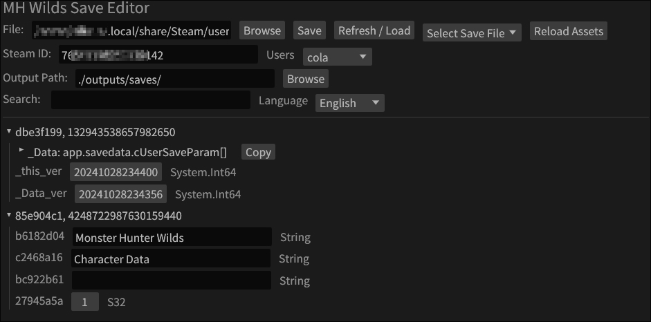
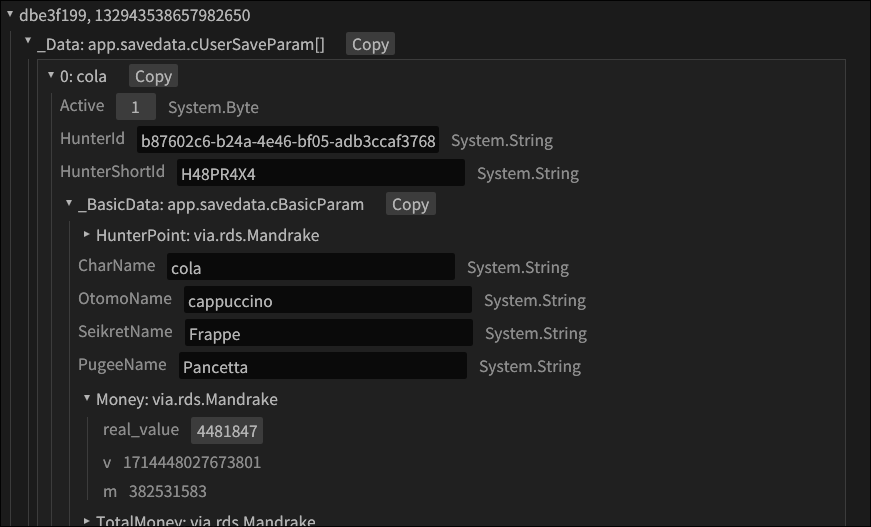
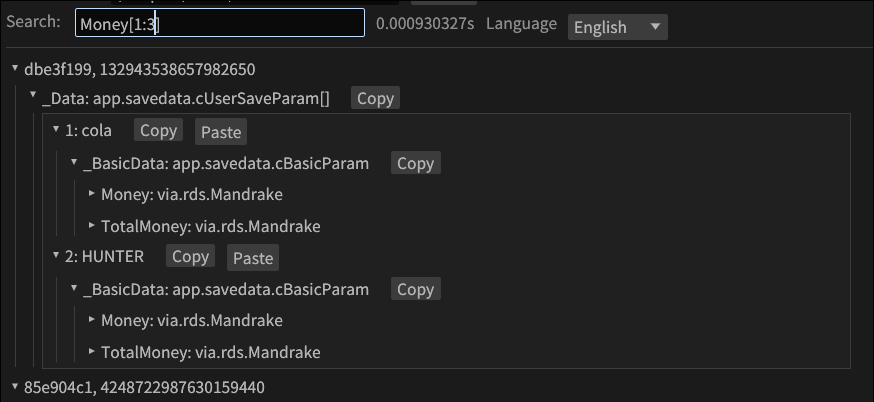
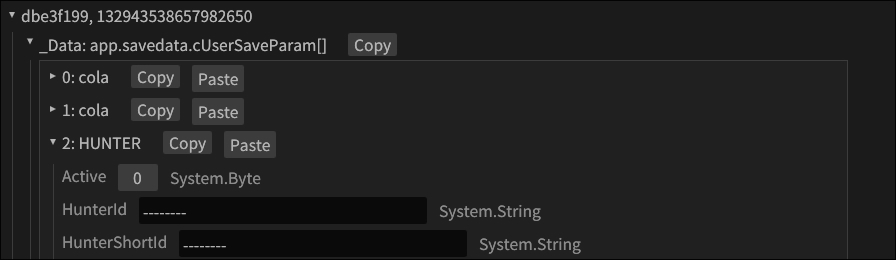
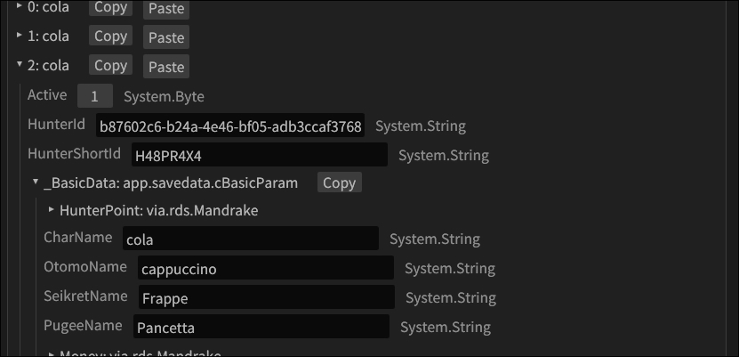
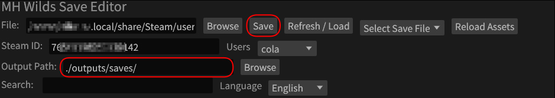
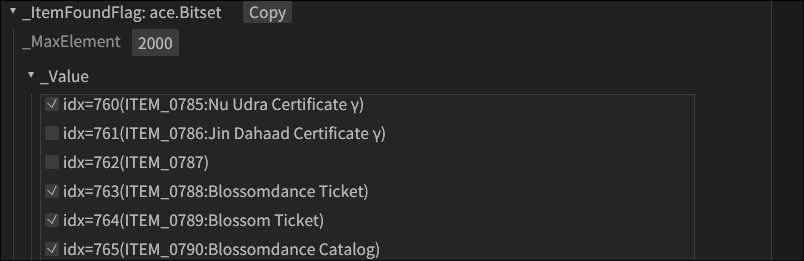
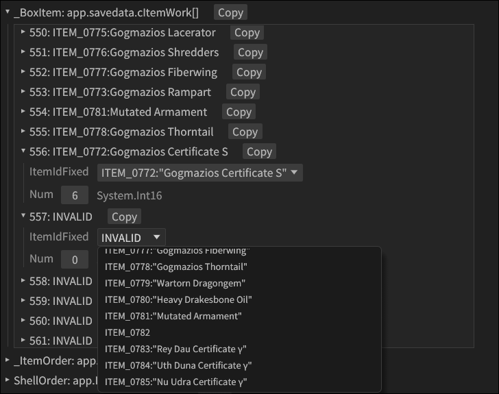
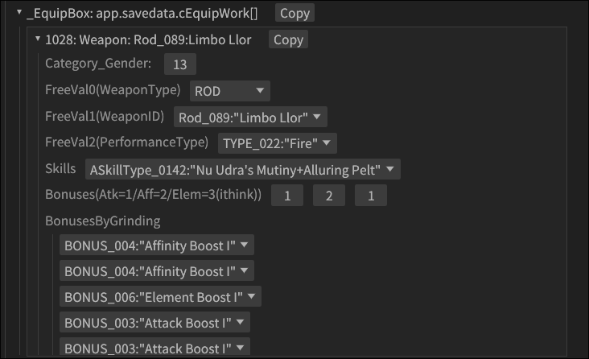

# Save Editor Usage Guide

> [!IMPORTANT]
> If using this for MH Rise Save Transferring, please make sure to follow the instructions [for rise](#monster-hunter-rise)

> [!IMPORTANT]
> ALWAYS MAKE BACKUPS BEFORE EDITING
> *ALWAYS MAKE BACKUPS BEFORE EDITING*
> **ALWAYS MAKE BACKUPS BEFORE EDITING**
> This editor allows for changing everything in the save file, however you really shouldn't mess around with things too much unless you are fine with some potential consequences.
> If you edit the wrong things, you can break your save, which can cause the game to not load

> [!WARNING]
> There's also a chance that giving yourself things like unreleased items or paid DLC content that you have not purchased can lead to your account to getting banned.
> Some edits can also lead you to losing some online stuff (I was tinkering around with some stuff and lost friends/followers/squads and challenge quest rankings/timings on my save for MH Wilds, idek why it happened, some weird online save corruption thing)

Currently, only Wilds is supported, but I'm working other games.

|Game|Steam AppID|Support|
|-|-|-|
|MH Wilds|2246340|✅ |
|MH Stories 3|2852190|✅ WIP|
|MH Rise|1446780|✅ WIP|
|RE9|1446780|✅ WIP|
|DD2|2054970|❌ WIP|
|Pragmata|3357650|❌ WIP|

## Setup

To start using the editor, you first need:
- To launch The Editor
    - [webgui](https://kvasszn.github.io/mhtame)
    - [Windows or Linux Builds](https://github.com/kvasszn/mhtame/releases/latest)
- [Steam ID](#finding-your-steam-id)
- [Save Files](#finding-your-save-files)

> [!TIP]
> If you are using the exe on windows or linux, it can automatically find users and save files for supported games based on your path to steam.

### Finding your Steam ID
If you want to do it manually, you can find your steam id through this site: [steamdb](https://steamdb.info/calculator/)

Once you have your steamid, enter it in the Steam ID box.

### Finding your Save Files
The save files should be in the `Path/To/Steam/userdata/<steam account id>/<appid>/remote/win64_save`.

You can get your account id from [steam db](https://steamdb.info/calculator/) as well (it's the lower 32-bits of your 64-bit steam id).

> [!NOTE]
> **EXAMPLE**
> If you are looking for MH Wilds save files and Steam is installed in `C:\Program Files (x86)\Steam`, and your account id is `1003123`, the path to the save files should be at:
> `C:\Program Files (x86)\Steam\userdata\1003123\remote\win64_save`

### Language

There's a drop down menu to change language, this will only change text correlated with enums. This is generated from game data so only languages that are available in-game are supported. Adding this is also a semi-manual process (I have to add what enum correlates to *.msg* file entry through a script to generate some json).

## Basic Editing

Once you have loaded in your save file, you should see something like this:

### Expanding

You can expand anything with a small arrow/triangle beside it by clicking on the arrow or text.

### Searching

You can also filter for things through searching. It will match field names and class types (e.g. *app.savedata.cBasicParam*). It also supports adding something like `[0:10]` (python style indexing) to filter arrays, however this works globally on every array, so it's not too useful at the moment.

### Copying/Pasting

It's possible to copy/paste classes (as fields or arrays elements). This can allow for things like moving around a character slot.

> [!IMPORTANT]
> For MH Wilds slot transfering see: [Slot Transfering](#account-transfer-and-slot-changing)

After pasting slot 2 to 3 (index 1 to 2).

### Saving

Once you find the field(s) you want to edit, make your changes and then click save.

> [!NOTE]
> On the Web version this will download the modified file.
> On Windows and Linux, it will output to the specified output path (default: `<install-location>/outputs/saves`)

### Steam Account Transfering
Transfering between steam accounts can be done by loading the save with the original steam ID, and then changing the Steam ID to the account you want the save to work on, and saving with that new Steam ID.

> [!IMPORTANT]
> For MH Wilds see: [Account Transfer](#account-transfer-and-slot-changing)

## Game Specific Editing

### Monster Hunter Rise

Transferring saves for rise is a little more complicated then other games due to how the encryption works. To properly transfer follow these steps to transfer to your account:
1. Get your steamid64 and enter it into the editor
1. Load your own mh rise save (it has to be attached to your steam account)
1. Once loaded, a number should appear beside some text saying `Citrus Curve Index`, make note of it
1. Enter the steamid64 of the save you're transferring to your account
1. Load that save
1. Change the `Citrus Curve Index` number to what you found in step 3
1. Save

### Monster Hunter Wilds

In MH Wilds, there are two main save files:
- *System Data* in `data00-1.bin`: contains stuff like settings, keyboard configs, etc
- *Character Data* in `data001Slot.bin`: contains all your hunter's data (item box, equipment, charms, etc)

There is also a third type which is the SS1* files, but they are not supported at the moment. These contain pictures taken in game.

> [!NOTE]
> Otomo means Palico
> **LongSword** means *Great Sword*, and **Tachi** means *Long Sword*

#### Account Transfer and Slot Changing
> [!NOTE]
> When changing accounts and slots, you will lose online related things, since the Hunter Id is associated with your steam account and slot.

In *Character Data*.

To transfer saves between accounts, you have to first load the save with the original steam id, then wipe `HunterId` and `HunterShortId` (just make them blank), then enter the steam id of the account you'd like to load the save on, and save.

You can then launch the game with that save and when you first go online, a new hunter id and short id will be generated for you.

To change slots, you have to copy the slot to where you want it, wipe the `HunterId` and `HunterShortId` in the new slot (where you copied it), and then save.

You can then load in with the new slot (you have to be online), and going into a lobby (multiplayer or singleplayer) will give the slot a new `HunterId`/`HunterShortId`.

Hunter IDs are very likely linked to steam accounts, which is why you have to reset them to make capcom generate new ones for you when you connect online.

> [!NOTE]
> You might also have to delete the `_Album` field in the slot when transfering slots or b/w steam accounts. The easiest way to do this is to copy `_Album` from an empty character slot, and paste into the target slots `_Album`.

#### Hunter/Palico Tickets Used

> [!NOTE]
> It's better to use an reframework script that prevents tickets from actually getting used for this
> This should only be done with the editor if you have already run out of tickets.

There are multiple edits required for this. The first is in the *System Data*.

You have to change the real_value field in `_Data->_SystemCommon->HunterTicketsUsed` (`PalicoTicketsUsed` for palicos), to 0.

The second is in Character Data. In each slot (`_Data->[0,1,2]`), change:

`_FreeBuffer->_BufferInt[18]` to 0 (for Hunter Tickets).
`_FreeBuffer->_BufferInt[19]` to 0 (for Palico Tickets).

#### Basic Data (Money, Points, Name, Palico Name, etc)

In *Character Data*: `_Data[<your hunter>]->_BasicData`

#### Item Box

In *Character Data*:
`_Data[<your hunter>]->_Item`
- `_PouchItem` is your item pouch
- `_PouchShell` is your ammo pouch
- `_BoxItem` is your item box

> [!NOTE]
> If you are adding an item that you have not previously obtained, you have to set the unlock flag as well in
> 

Alot of these use similar storage types that can be edited in basically the same way. Change `Num` to edit the number of items you have.

#### Equipment

> [!NOTE]
> Otomo means Palico
> **LongSword** means *Great Sword*, and **Tachi** means *Long Sword*

In *Character Data*:
`_Data[<your hunter>]->_Equip`
- `_EquipBox` is your equipment storage (weapons, armor, charms)
- `_WeaponFlagParam` is what weapons you have unlocked
    - change values in `_<weapon type>CreateBit`
- `_Armor<Male/Female>FlagParam` is what armors you have unlocked
    - go to `_ArmorCreatedParam->_<Helm/Body/Arm/Waist/Leg>Bit->_Value` to change what series you have unlocked for each one
    - this is a little annoying to do, but it's just a consequence of how the data is stored in the save file
- `OuterArmorFlags` is what layered armor you have, just toggle whatever armors you want in `_Value` to unlock them
- `OuterWeaponFlagParam->_<weapon type>` is what layered weapons you have, edit in the save way as outer armor and other bitsets
- Palico equipment follows a similar pattern (Ot(omo) == Palico)
- `_ArtianPartsBox` is where artian creation parts are stored, for some reason this array fills up in reverse, idk why capcom chose to do it like this, but you have to scroll to the end to find things
    - This seems to not work great for Tarred stuff, i think some enums are different based on if its a gog part or normal, need to add support for that.
    - Change `Num` to edit the number of parts you have

> [!NOTE]
> If you unlock an armor piece or weapon, it only changes things regarding the smithy
> To actually obtain it you have to ALSO add it to your Equipment Box

##### Gogma Artian Editing
I'd recommend first creating a weapon normally, and then editing that one.

You can change FreeVal0(WeaponType) to change weapon type.

FreeVal1(WeaponID) determines the weapon you're changing, for gog artian weapons, there are for each one, they should be attack, affinity, and element in order (I need to add something to specify what's what).

You can change the PerformanceType for element, idk why there's multiple, but they do different things for some weapons i think (I also need to add stuff for that).

You can select what combination of skills you want form the skills dropdown.

You can change bonuses by setting values to 1, 2, and 3 for attack, affinity and element respectively.

You can also change BonusByGrinding to change what boosts you get.
> [!IMPORTANT]
> MAKE SURE THAT THE COMBINATION YOU MAKE IS LEGAL
> I plan on adding some checks for it in the future
> I think the main thing is you can only have 2 EX bonuses for each type (e.g 2 attack EX, etc)

#### Hunter Profile
TODO

#### Story/Progression
> [!IMPORTANT]
> There is alot of different things that change in the save file when you progress through the story so manually changing flags through the save editor is very compicated
> It's better to try and get a pre-leveled save file, and transfer it to your account

